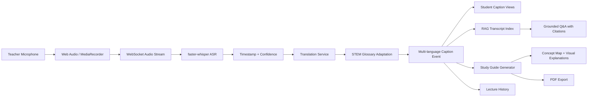

# ClassBridge

## Real-Time Vernacular Lecture Companion

**Smart India Hackathon | EDU-02**  
**Team:** [Team Name]  
**Institution:** [Institution Name]

---

## Slide 1: The Problem

### Fast lectures create an unequal learning experience

- STEM lectures often move faster than students can listen, understand, and take notes.
- English-first instruction creates an additional barrier for vernacular learners.
- Students miss technical explanations and leave without structured revision material.
- Teachers repeat the same explanation while students struggle to keep up.

**Target users:** students in multilingual classrooms, STEM teachers, colleges, and remote learners.

**Speaker line:**

> The problem is not only translation. It is comprehension during the lecture and retention after the lecture.

---

## Slide 2: Our Solution

### ClassBridge connects live understanding with later revision

ClassBridge captures a teacher's lecture, converts speech into live captions, translates technical explanations into each student's preferred language, and turns the transcript into grounded study material.

```text
Teacher Speech
      |
      v
Live ASR + Confidence
      |
      v
STEM-Aware Translation
      |
      +--> Student-Specific Captions
      +--> Grounded Q&A
      +--> Study Guide + Visuals + PDF
      +--> Lecture History
```

**Core promise:** one teacher stream, many student language preferences, one reusable learning record.

---

## Slide 3: What Makes It Innovative

### More than a caption translator

- **Independent student languages:** one student can choose Tamil while another chooses Malayalam.
- **STEM terminology protection:** glossary adaptation prevents literal translations of concepts such as gradient descent and eigenvalue.
- **Grounded AI tutor:** answers are linked to transcript timestamps instead of being free-form guesses.
- **Retention-first output:** definitions, formulas, takeaways, flashcards, concept maps, graphs, and PDF export.
- **Classroom resilience:** online classroom, real-time offline classroom, browser demo mode, and mobile PCM audio fallback.

---

## Slide 4: Technology Stack

| Layer              | Technology                                | Purpose                                      |
| ------------------ | ----------------------------------------- | -------------------------------------------- |
| Frontend           | React 19 + Vite                           | Responsive classroom workspace               |
| Speech recognition | faster-whisper                            | Lecture audio to timestamped text            |
| Mobile audio       | Web Audio + PCM fallback                  | Captures devices without Web Speech support  |
| Translation        | Google/deep-translator + offline fallback | English, Tamil, Malayalam, Hindi             |
| Domain adaptation  | Curated STEM glossary                     | Protects technical terminology               |
| Q&A                | In-memory RAG + optional Gemini           | Transcript-grounded answers and citations    |
| Study synthesis    | Gemini or deterministic fallback          | Summaries, definitions, formulas, flashcards |
| Documents          | ReportLab                                 | Downloadable academic PDFs                   |
| Deployment         | Vercel + Render/Railway                   | Scalable frontend and backend topology       |

**Design principle:** AI is used where intelligence is needed; deterministic fallbacks keep the classroom usable when external services are unavailable.

---

## Slide 5: Architecture and Workflow



### Two classroom modes

- **Real-Time [Offline] Class:** teacher mic broadcasts to nearby student devices.
- **Online Class:** remote camera, audio, and multilingual captions for distributed learners.

---

## Slide 6: Implementation and Live Demo

### Five-minute demonstration flow

1. Click **Demo Showcase**.
2. Show live English + vernacular captions with timestamps and confidence.
3. Select **BridgeAI Tutor** and ask: `What is gradient descent?`
4. Click the timestamp citation to return to the source caption.
5. Open **Study Guide** and show definitions, formula, and flashcard.
6. Open **Concept Map** and show:
   - Loss curve
   - Neural-network flow
   - Parameter-update equation
7. Open **History** and restore a saved lecture.

### Demonstrated output

- Caption source: English
- Student output: Tamil, Malayalam, Hindi, or English
- Technical concepts: gradient descent, backpropagation, learning rate, loss, overfitting

---

## Slide 7: Impact and Benefits

### Educational impact

- Reduces language-based comprehension barriers during STEM lectures.
- Gives each learner a preferred vernacular without changing classmates' views.
- Makes technical terms explainable instead of relying on literal machine translation.
- Converts a live lecture into a searchable, reusable revision resource.
- Reduces repeated explanations and improves teacher-student interaction.

### Practical benefits

- Browser-based frontend with deployable backend.
- Works in online and classroom settings.
- Uses open-source ASR and deterministic fallbacks for cost control.
- PDF and local history support learning after the class ends.

---

## Slide 8: Future Scope and Scalability

### From hackathon MVP to education platform

- Persistent cloud lecture history with accounts and cross-device access.
- Authenticated classrooms, teacher dashboards, and attendance analytics.
- Audio denoising, speaker detection, accent adaptation, and overlapping-speech handling.
- Dedicated Indic translation models with terminology memory and quality monitoring.
- Subject-specific diagram generation for mathematics, physics, biology, and engineering.
- Scalable WebSocket infrastructure with queues, regional inference, and reconnect/resume support.
- Learning analytics to measure comprehension, revision activity, and student outcomes.

### Responsible AI roadmap

- Keep transcript evidence attached to generated answers and notes.
- Clearly label external reference content.
- Add consent, retention controls, deletion, and classroom privacy policies.

---

## Slide 9: Conclusion

### ClassBridge makes every lecture understandable and reusable

```text
Understand now  ->  Ask with evidence  ->  Revise later
```

- Real-time vernacular captions
- STEM-aware translation
- Grounded AI tutor
- Visual study synthesis
- Persistent lecture recovery

**Call to action:**

> Help us make multilingual STEM education more accessible, measurable, and effective for every learner.

**Demo:** [Insert deployed Vercel URL]

---

## Judge Questions: Short Answers

**Where is the AI?**  
Whisper performs ASR, translation services translate speech, glossary adaptation protects STEM terms, and RAG/Gemini supports grounded Q&A and study synthesis.

**What happens if the API is unavailable?**  
The browser and backend use glossary, offline dictionary, deterministic study-guide, and demo fallbacks.

**How is this different from subtitles?**  
ClassBridge supports student-specific languages, technical terminology, grounded questions, visual explanations, structured notes, PDF export, and lecture history.

**What is the current limitation?**  
History is browser-local in the MVP, and production scale would require persistent storage, stronger classroom-noise evaluation, authentication, and scalable inference.
